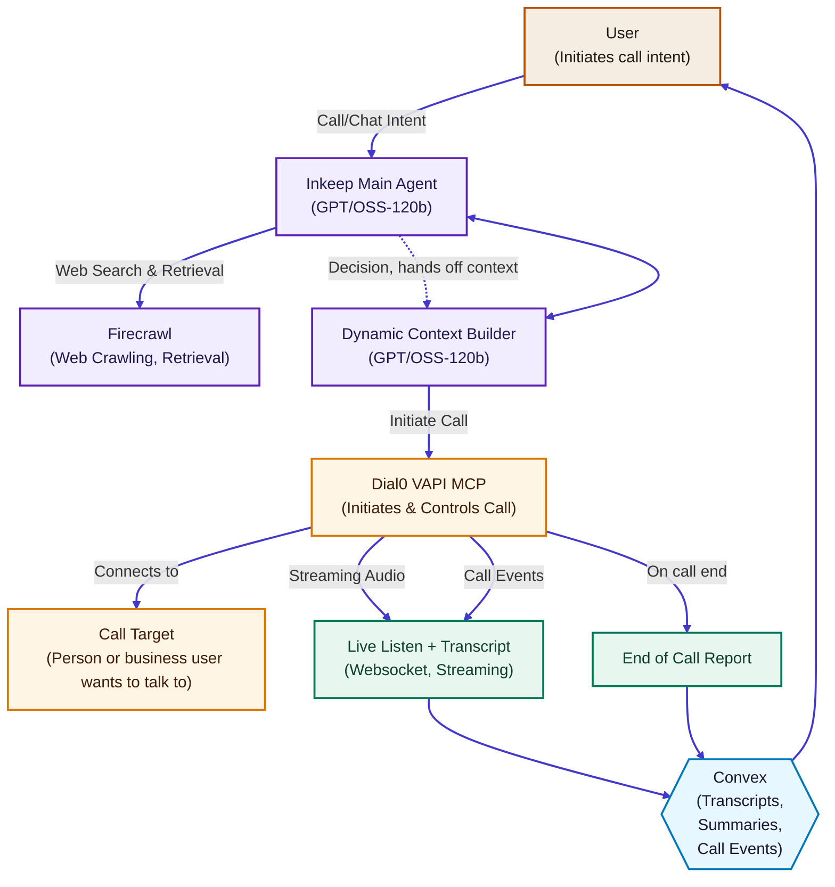

# Dial0

<div align="center">
  
  
  **Research, call orchestration, and founder oversight in one loop.**
  
  [](https://nextjs.org/)
  [](https://react.dev/)
  [](https://www.typescriptlang.org/)
  [](https://convex.dev/)
  [](https://vapi.ai/)
  [](https://openai.com/)
  [](https://www.firecrawl.dev/)
  [](https://inkeep.com/)
  [](https://www.useautumn.com/)
  [](https://resend.com/)
</div>

Dial0 is an agentic voice operations platform that researches a request, orchestrates an outbound phone call with cloned voices, and streams transcripts, status, and reports back to founders in real time.

Start a call from the dashboard, watch transcripts and monitor URLs update live, and ship the end-of-call report directly into your workflows.

## Overview

The app combines a Next.js interface, Convex real-time backend, and Vapi voice automation to take a typed user intent and convert it into a fully managed call. Context is assembled through Inkeep + Firecrawl research, routed through a guardrailed system prompt, and executed via Vapi while founders monitor transcripts, events, and outcomes inside the dashboard.

## Architecture at a glance



### Legend
- **Intake & Trust** Founders capture intent and preferences that frame the call.
- **Intelligence & Planning** Inkeep and Firecrawl assemble research and guardrails before dialing.
- **Voice Execution** Dial0’s Vapi MCP initiates and controls the call with cloned voices.
- **Data & Oversight** Convex persists transcripts, summaries, and alerts for live oversight.

## Feature highlights
- **Intent-driven calls** Conversation context is composed in `app/api/vapi/start-call/route.ts` from Convex state and delivered as a system prompt.
- **Live transcripts & status** `hooks/use-chat.ts` merges Convex call events, transcripts, and streaming SSE responses into rich chat bubbles.
- **Voice cloning & overrides** `convex/actions/voiceCloning.ts` registers ElevenLabs voices while settings (`api.orchestration.getSettings`) handle per-user overrides.
- **Dynamic research loop** Firecrawl + Inkeep enrich issues before dialing to improve first-call resolution.
- **Founder supervision** Components like `components/chat/live-call-transcript.tsx` stream monitoring links, recordings, and summaries in real time.

## 🚀 Technology stack

### Frontend
- **[Next.js 15.5.3](https://nextjs.org/)** – App Router UX with server actions and streaming UI.
- **[React 18](https://react.dev/)** – Concurrent rendering, hooks-first components.
- **[TypeScript 5](https://www.typescriptlang.org/)** – End-to-end typed client and server code.
- **[Tailwind CSS 4.1.9](https://tailwindcss.com/)** – Utility design system for rapid iteration.
- **[Radix UI](https://www.radix-ui.com/)** – Accessible primitives for dialogs, menus, and overlays.
- **[Lucide React](https://lucide.dev/)** – Crisp iconography across dashboards and controls.
- **[Next Themes](https://github.com/pacocoursey/next-themes)** – Dark/light theme management.
- **[Sonner](https://sonner.emilkowal.ski/)** – High-signal toast notifications during live calls.

### Backend & data
- **[Convex](https://convex.dev/)** – Real-time database, queries, and mutations powering the agent loop.
- **[Convex Actions](https://docs.convex.dev/functions/actions)** – Secure server-side bridges into external APIs.
- **[Better Auth](https://better-auth.com/)** – Session + magic link auth flows (via `@convex-dev/better-auth`).
- **[Autumn](https://www.useautumn.com/)** – Usage metering and billing hooks for minutes and issues.

### AI, voice, and research
- **[Vapi](https://vapi.ai/)** – Voice MCP orchestrating outbound calls and tool execution.
- **[OpenAI / GPT-OSS-120b](https://openai.com/)** – Primary reasoning model served through Groq.
- **[ElevenLabs](https://elevenlabs.io/)** – Voice cloning and natural speech synthesis (via Vapi integrations).
- **[Deepgram](https://deepgram.com/)** – Streaming transcription for live call monitoring.
- **[Inkeep](https://inkeep.com/)** – Structured knowledge retrieval for call context and answers.
- **[Firecrawl](https://www.firecrawl.dev/)** – Web research enrichment before dialing.

### Communications & tooling
- **[Resend](https://resend.com/)** – Transactional email for auth, alerts, and call summaries.
- **[Bun](https://bun.sh/)** – Dev/runtime tooling (install, scripts, server).
- **[concurrently](https://github.com/open-cli-tools/concurrently)** – Parallel Next.js + Convex dev servers.
- **[Zod](https://zod.dev/)** – Input validation for API routes and prompts.
- **[Mermaid](https://mermaid.js.org/)** – Diagramming for architecture visualizations.

## Key directories
- `app/` Next.js routes, including `/api/chat` SSE proxy and `/api/vapi/start-call` dial orchestration.
- `components/` UI primitives and live call visualizations (`components/chat/*`).
- `convex/` Database schema, queries, mutations, and actions powering the agent loop.
- `hooks/` Client hooks such as `useChat()` for streaming UI state.
- `lib/` Auth helpers, geo enrichment, default voice definitions, and AI integrations.

## Getting started
```bash
git clone https://github.com/rsvedant/Dial0
cd Dial0

# Bun (recommended)
bun install

# or npm
npm install
```

### Environment variables
Copy `.env.example` and fill in secrets:
```bash
cp .env.example .env.local
```
- **Convex** `CONVEX_DEPLOYMENT`, `NEXT_PUBLIC_CONVEX_URL`, `NEXT_PUBLIC_CONVEX_SITE_URL`.
- **Vapi** `VAPI_PRIVATE_API_KEY`, `VAPI_PUBLIC_API_KEY`, `VAPI_PUBLIC_ASSISTANT_ID`, `VAPI_PHONE_NUMBER_ID`, `VAPI_ORG_ID`, optional `VAPI_WEBHOOK_URL` for ngrok tunnels.
- **Resend + auth** `RESEND_API_KEY`, `RESEND_FROM`, `INTERNAL_EMAIL_PROXY_SECRET`.
- **Agent research** `AGENT_BASE_URL`, `AGENT_API_KEY`.
- **Autumn usage & GitHub OAuth** `AUTUMN_SECRET_KEY`, `GITHUB_CLIENT_ID`, `GITHUB_CLIENT_SECRET`.

### Run the stack
```bash
# Start Convex locally (reads CONVEX_DEPLOYMENT)
bunx convex dev

# In another terminal
export $(grep -v '^#' .env.local | xargs)
bun run dev
```
This runs `next dev --turbopack` alongside Convex via the `dev` script. Visit `http://localhost:3000` for the dashboard.

### Vapi webhook
- `VAPI_WEBHOOK_URL` can point to an ngrok tunnel to receive call events while local.
- Outbound requests include `issueId` and `authToken` for Convex correlation and are persisted via `api.orchestration.appendCallEvent`.

## Deployment
- **Frontend** Deploy to Vercel or Bun-compatible hosts (`next build` + `next start`).
- **Convex** Promote with `bunx convex deploy`.
- **Secrets** Mirror your `.env.local` values into production platforms (Vercel, Convex dashboard, Vapi console).

## Contributing
Open issues or pull requests are welcome—focus on incremental improvements to the agent loop, observability, and voice quality.

---

Built with ❤️ by the Dial0 team.
