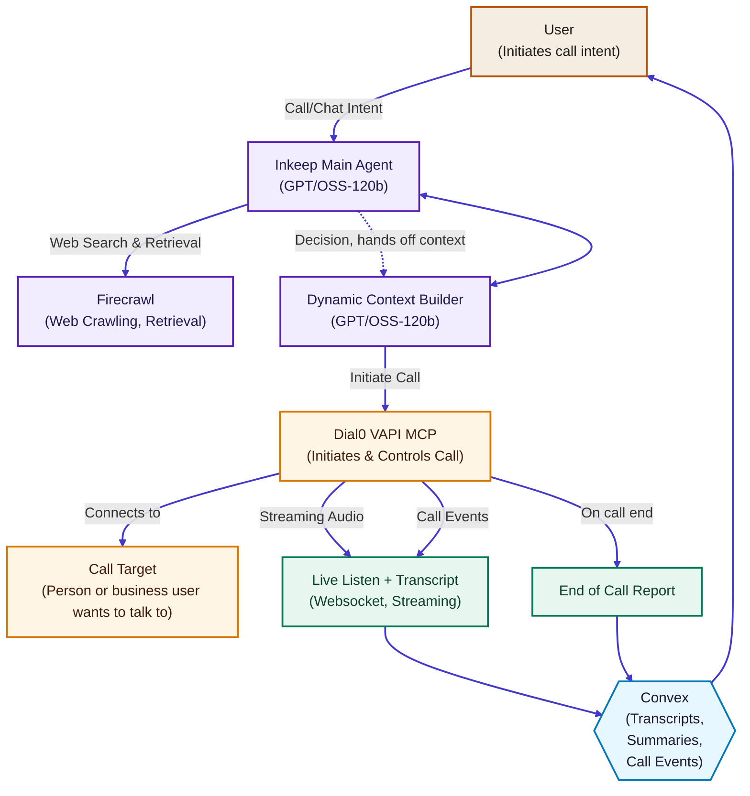

# Dial0

Dial0 is an agentic voice operations platform that researches a request, orchestrates an outbound phone call with cloned voices, and streams transcripts, status, and reports back to founders in real time.

## Overview

The app combines a Next.js interface, Convex real-time backend, and Vapi voice automation to take a typed user intent and convert it into a fully managed call. Context is assembled through Inkeep + Firecrawl research, routed through a guardrailed system prompt, and executed via Vapi while founders monitor transcripts, events, and outcomes inside the dashboard.

## Architecture at a glance



### Legend
- **Intake & Trust** Founders capture intent and preferences that frame the call.
- **Intelligence & Planning** Inkeep and Firecrawl assemble research and guardrails before dialing.
- **Voice Execution** Dial0’s Vapi MCP initiates and controls the call with cloned voices.
- **Data & Oversight** Convex persists transcripts, summaries, and alerts for live oversight.

## Feature highlights
- **Intent-driven calls** Conversation context is composed in `app/api/vapi/start-call/route.ts` from Convex state and delivered as a system prompt.
- **Live transcripts & status** `hooks/use-chat.ts` merges Convex call events, transcripts, and streaming SSE responses into rich chat bubbles.
- **Voice cloning & overrides** `convex/actions/voiceCloning.ts` registers ElevenLabs voices while settings (`api.orchestration.getSettings`) handle per-user overrides.
- **Dynamic research loop** Firecrawl + Inkeep enrich issues before dialing to improve first-call resolution.
- **Founder supervision** Components like `components/chat/live-call-transcript.tsx` stream monitoring links, recordings, and summaries in real time.

## Tech stack
- **Frontend** Next.js App Router, React 18, TypeScript, Tailwind, Radix UI, `sonner` toasts.
- **Backend** Convex queries, mutations, and actions for stateful orchestration.
- **Voice + AI** Vapi (Groq GPT-OSS-120b), Deepgram transcription, ElevenLabs voices, Inkeep RAG, Firecrawl web research, Autumn metering, Resend email flows.
- **Tooling** Bun (recommended), concurrently, Zod validation, Mermaid for diagrams.

## Key directories
- `app/` Next.js routes, including `/api/chat` SSE proxy and `/api/vapi/start-call` dial orchestration.
- `components/` UI primitives and live call visualizations (`components/chat/*`).
- `convex/` Database schema, queries, mutations, and actions powering the agent loop.
- `hooks/` Client hooks such as `useChat()` for streaming UI state.
- `lib/` Auth helpers, geo enrichment, default voice definitions, and AI integrations.

## Getting started
```bash
git clone https://github.com/rsvedant/Dial0
cd Dial0

# Bun (recommended)
bun install

# or npm
npm install
```

### Environment variables
Copy `.env.example` and fill in secrets:
```bash
cp .env.example .env.local
```
- **Convex** `CONVEX_DEPLOYMENT`, `NEXT_PUBLIC_CONVEX_URL`, `NEXT_PUBLIC_CONVEX_SITE_URL`.
- **Vapi** `VAPI_PRIVATE_API_KEY`, `VAPI_PUBLIC_API_KEY`, `VAPI_PUBLIC_ASSISTANT_ID`, `VAPI_PHONE_NUMBER_ID`, `VAPI_ORG_ID`, optional `VAPI_WEBHOOK_URL` for ngrok tunnels.
- **Resend + auth** `RESEND_API_KEY`, `RESEND_FROM`, `INTERNAL_EMAIL_PROXY_SECRET`.
- **Agent research** `AGENT_BASE_URL`, `AGENT_API_KEY`.
- **Autumn usage & GitHub OAuth** `AUTUMN_SECRET_KEY`, `GITHUB_CLIENT_ID`, `GITHUB_CLIENT_SECRET`.

### Run the stack
```bash
# Start Convex locally (reads CONVEX_DEPLOYMENT)
bunx convex dev

# In another terminal
export $(grep -v '^#' .env.local | xargs)
bun run dev
```
This runs `next dev --turbopack` alongside Convex via the `dev` script. Visit `http://localhost:3000` for the dashboard.

### Vapi webhook
- `VAPI_WEBHOOK_URL` can point to an ngrok tunnel to receive call events while local.
- Outbound requests include `issueId` and `authToken` for Convex correlation and are persisted via `api.orchestration.appendCallEvent`.

## Deployment
- **Frontend** Deploy to Vercel or Bun-compatible hosts (`next build` + `next start`).
- **Convex** Promote with `bunx convex deploy`.
- **Secrets** Mirror your `.env.local` values into production platforms (Vercel, Convex dashboard, Vapi console).

## Contributing
Open issues or pull requests are welcome—focus on incremental improvements to the agent loop, observability, and voice quality.

---

Built with ❤️ by the Dial0 team.
