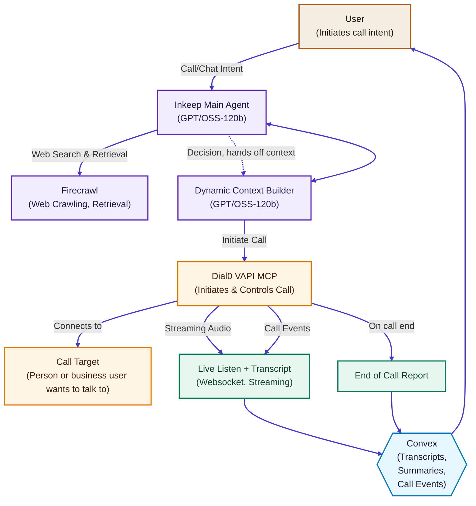

# Dial0 Agentic Control Loop

## Legend
- **Intake & Trust** Founders capture intent and preferences that frame the call.
- **Intelligence & Planning** Inkeep and Firecrawl assemble research and guardrails before dialing.
- **Voice Execution** Dial0’s Vapi MCP initiates and controls the call with cloned voices.
- **Data & Oversight** Convex persists transcripts, summaries, and alerts for live oversight.

## How the loop works
- **Intent capture** Founders provide goals, verification, and contact details through the Next.js dashboard.
- **Context synthesis** Inkeep + Firecrawl gather external knowledge; Convex stores structured context for the call.
- **Call execution** Vapi (Groq GPT-OSS-120b + ElevenLabs voices + Deepgram transcription) dials the target and streams events.
- **Live oversight** `hooks/use-chat.ts` fuses Convex transcripts, call events, and system updates into supervisor UI components under `components/chat/`.
- **Outcomes & reporting** End-of-call reports, recordings, and summaries return to Convex for auditing, Autumn usage tracking, and follow-up workflows.
